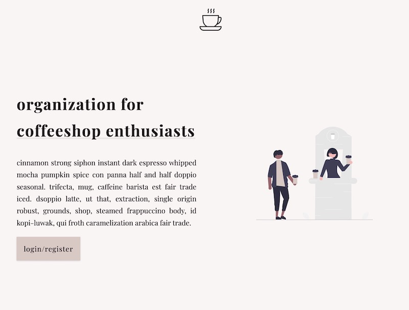
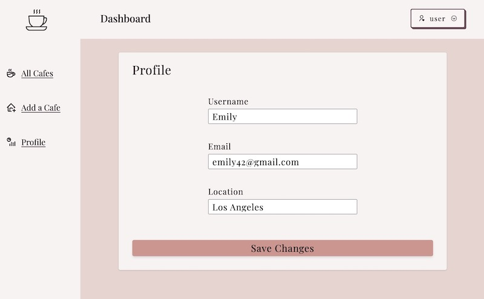
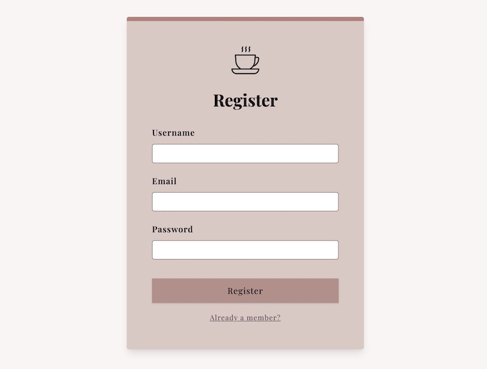
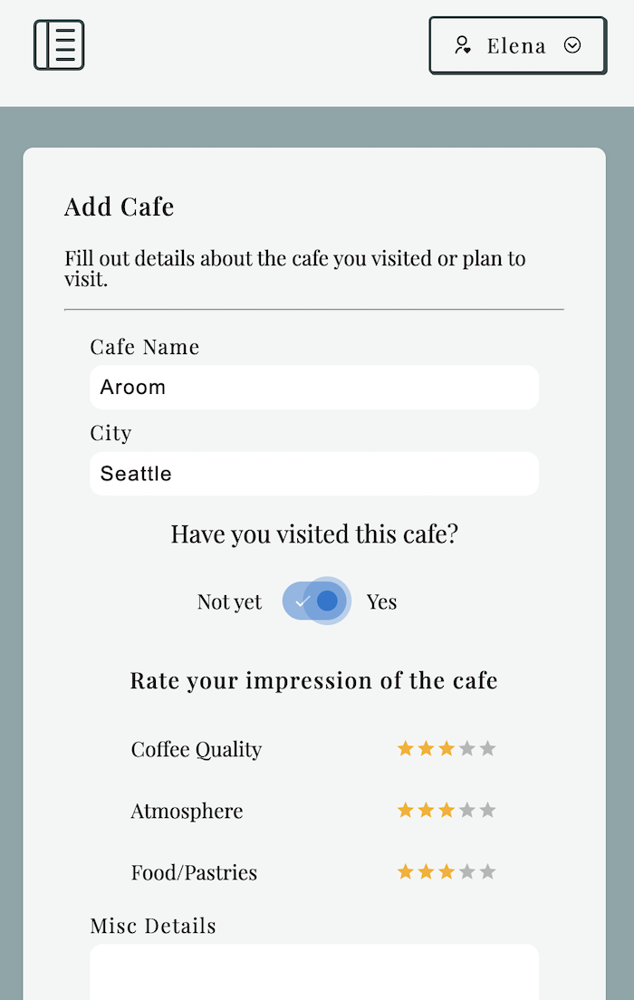
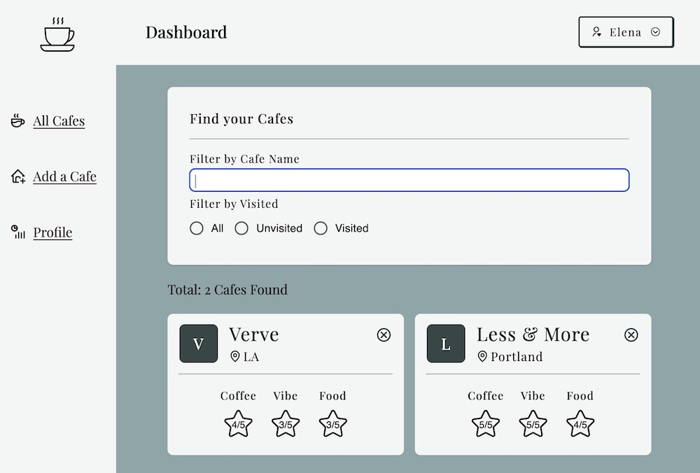

## Coffeeshop Tracking

See live site at: https://cafe-rating.onrender.com/
Initial load times may be slow due to Render.

Coffeeshop tracking app is designed to help cafe hoppers better keep track of their coffeeshop experiences. Users can create secure, individual profiles to log their thoughts and impressions, as well as make plans for spots they plan to visit.

## Technologies

This responsive web app uses JavaScript, React, Node.js, Express, MongoDB Atlas, Mongoose, and Styled Components.

